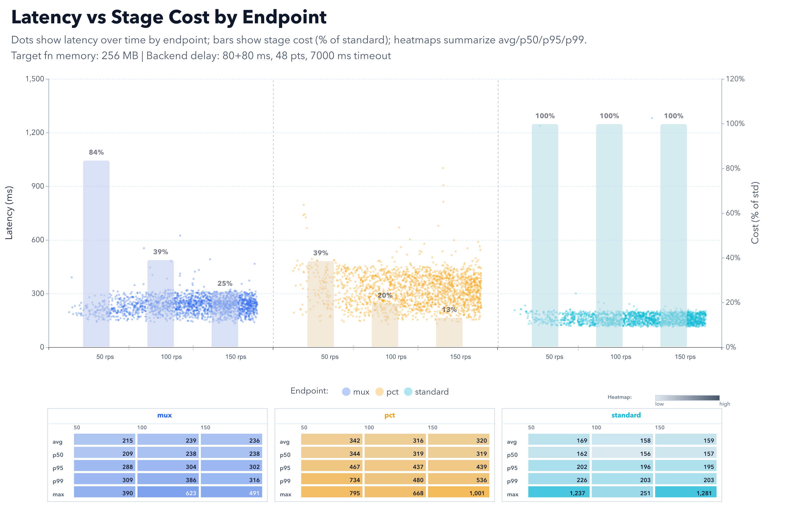

# Benchmark Report

Executor: ramping-arrival-rate
Mode: per_endpoint
Max delay: 0ms
Endpoints: mux, pct, standard

## Test Configuration

Region: `us-east-1`

### Workload Shape

| Stage | Window | Duration | From rps | To rps |
| ---: | :-- | :-- | ---: | ---: |
| 1 | 0-180s | 3m | 0 | 50 |
| 2 | 180-360s | 3m | 50 | 100 |
| 3 | 360-540s | 3m | 100 | 150 |

### k6 Settings

| Setting | Value |
| :-- | :-- |
| Executor | `ramping-arrival-rate` |
| Mode | `per_endpoint` |
| Profile | `default` |
| Total scheduled duration | `540s` |
| Max delay query value | `0ms` |
| Warmup requests | `true` |
| Keyspace size | `1000` |
| Arrival time unit | `1s` |
| Arrival VUs multiplier | `1` |
| Arrival max VUs multiplier | `2` |
| Ramping VUs setting | `50` |

### Endpoint Labels

| Endpoint |
| :-- |
| mux |
| pct |
| standard |

### Stack Parameters

| Parameter | Value |
| :-- | :-- |
| BenchmarkHandlerMemorySize | `256` |
| BenchmarkBackendBaseDelayMs | `80` |
| BenchmarkBackendJitterMs | `80` |
| BenchmarkBackendPoints | `48` |
| BenchmarkBackendTimeoutMs | `7000` |
| KhoneMaxConcurrency | `16` |

### Lambda Configuration

_Lambda configuration was not captured for this run._

## Key Findings

- Fastest p95 endpoint: **standard** at **195.62 ms**.
- Most cost-efficient endpoint (estimate): **pct** at **17.63%** of standard baseline.
- Lowest observed error rate is a tie at **0.000%** across: **mux, pct, standard**.

## Endpoint Ranking

| Rank | Endpoint | p95 (ms) | Error rate | Cost (% of standard) | Effective batch | Requests |
| ---: | :-- | ---: | ---: | ---: | ---: | ---: |
| 1 | standard | 195.62 | 0.000% | 100.00 | 1.00 | 40499 |
| 2 | mux | 303.20 | 0.000% | 36.37 | 2.75 | 40498 |
| 3 | pct | 680.06 | 0.000% | 17.63 | 5.67 | 40499 |

## Stage Latency Stats (per endpoint)

Computed from sampled `http_req_duration` points with status `200`, grouped by configured stage windows.

### mux

| Stage | Target (rps) | Window (s) | Samples | Avg (ms) | p50 (ms) | p95 (ms) | p99 (ms) | Max (ms) |
| ---: | ---: | :-- | ---: | ---: | ---: | ---: | ---: | ---: |
| 1 | 50 | 0-180 | 228 | 214.58 | 208.79 | 287.62 | 308.60 | 389.98 |
| 2 | 100 | 180-360 | 682 | 239.16 | 238.47 | 304.47 | 385.94 | 623.43 |
| 3 | 150 | 360-540 | 1090 | 236.16 | 238.47 | 302.15 | 315.67 | 491.02 |

### pct

| Stage | Target (rps) | Window (s) | Samples | Avg (ms) | p50 (ms) | p95 (ms) | p99 (ms) | Max (ms) |
| ---: | ---: | :-- | ---: | ---: | ---: | ---: | ---: | ---: |
| 1 | 50 | 0-180 | 236 | 341.58 | 344.16 | 467.38 | 733.65 | 795.27 |
| 2 | 100 | 180-360 | 704 | 316.30 | 318.78 | 437.10 | 479.59 | 668.41 |
| 3 | 150 | 360-540 | 1060 | 319.88 | 319.04 | 438.57 | 535.90 | 1000.78 |

### standard

| Stage | Target (rps) | Window (s) | Samples | Avg (ms) | p50 (ms) | p95 (ms) | p99 (ms) | Max (ms) |
| ---: | ---: | :-- | ---: | ---: | ---: | ---: | ---: | ---: |
| 1 | 50 | 0-180 | 234 | 168.53 | 161.61 | 201.79 | 225.57 | 1237.39 |
| 2 | 100 | 180-360 | 696 | 157.58 | 155.69 | 196.03 | 202.63 | 250.85 |
| 3 | 150 | 360-540 | 1070 | 158.95 | 156.86 | 194.65 | 203.19 | 1280.73 |

## Charts

### Latency distribution

<picture>
  <source media="(prefers-color-scheme: dark)" srcset="charts/dark/latency-distribution.png">
  <source media="(prefers-color-scheme: light)" srcset="charts/light/latency-distribution.png">
  
</picture>
