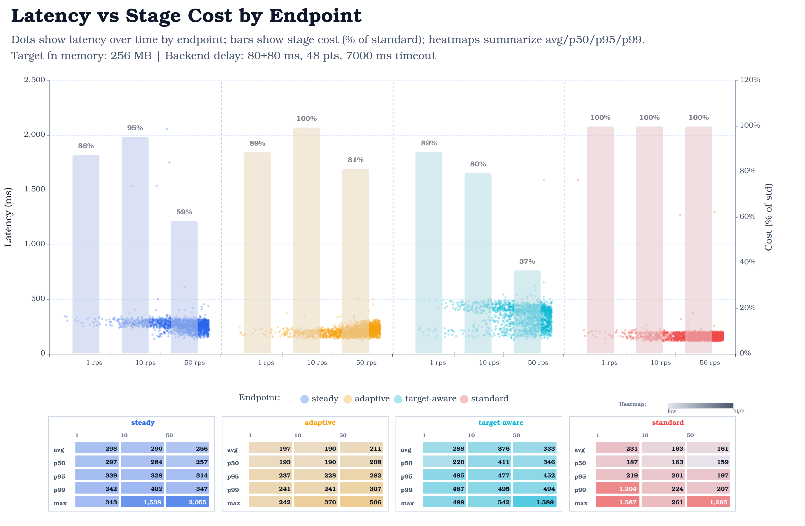

# Benchmark Report

Executor: ramping-arrival-rate
Mode: per_endpoint
Max delay: 0ms
Endpoints: steady, adaptive, target-aware, standard

## Test Configuration

Region: `us-east-1`

### Workload Shape

| Stage | Window | Duration | From rps | To rps |
| ---: | :-- | :-- | ---: | ---: |
| 1 | 0-300s | 5m | 0 | 1 |
| 2 | 300-600s | 5m | 1 | 10 |
| 3 | 600-900s | 5m | 10 | 50 |

### k6 Settings

| Setting | Value |
| :-- | :-- |
| Executor | `ramping-arrival-rate` |
| Mode | `per_endpoint` |
| Profile | `default` |
| Total scheduled duration | `900s` |
| Max delay query value | `0ms` |
| Warmup requests | `true` |
| Keyspace size | `1000` |
| Arrival time unit | `1s` |
| Arrival VUs multiplier | `1` |
| Arrival max VUs multiplier | `2` |
| Ramping VUs setting | `50` |

### Endpoint Labels

| Endpoint |
| :-- |
| steady |
| adaptive |
| target-aware |
| standard |

### Stack Parameters

| Parameter | Value |
| :-- | :-- |
| BenchmarkHandlerMemorySize | `256` |
| BenchmarkBackendBaseDelayMs | `80` |
| BenchmarkBackendJitterMs | `80` |
| BenchmarkBackendPoints | `48` |
| BenchmarkBackendTimeoutMs | `7000` |
| KhoneMaxConcurrency | `16` |

### Lambda Configuration

_Lambda configuration was not captured for this run._

### Benchmark Scenario Notes

- Target handler Lambdas call the benchmark backend Lambda URL for each item; the backend simulates a delayed downstream response before returning JSON.
- This models an I/O-bound handler where request time is dominated by waiting on another service; CPU-bound handlers are less likely to benefit from batching because there are fewer wait states to overlap.
- Backend delay is `80` ms base plus `80` ms item-key-seeded jitter, for an effective `80-160 ms` backend sleep. This is separate from the k6 max-delay query value.
- Backend responses include `48` generated points per item.
- Benchmark handlers use a `7000` ms timeout when calling the backend.
- The LMI capacity provider for this public run was configured with `m8g` instances. The gateway template used `2048 MB`, `arm64`, `64` concurrent requests per execution environment, `2.0 GiB/vCPU`, and `4/4` execution environments.

## Key Findings

- Fastest p95 endpoint: **standard** at **196.94 ms**.
- Most cost-efficient endpoint (estimate): **target-aware** at **45.02%** of standard baseline.
- Lowest observed error rate is a tie at **0.000%** across: **steady, adaptive, target-aware, standard**.

## Endpoint Ranking

| Rank | Endpoint | p95 (ms) | Error rate | Cost (% of standard) | Effective batch | Requests |
| ---: | :-- | ---: | ---: | ---: | ---: | ---: |
| 1 | standard | 196.94 | 0.000% | 100.00 | 1.00 | 10800 |
| 2 | adaptive | 283.99 | 0.000% | 84.97 | 1.18 | 10799 |
| 3 | steady | 316.06 | 0.000% | 65.79 | 1.52 | 10799 |
| 4 | target-aware | 472.90 | 0.000% | 45.02 | 2.22 | 10800 |

## Stage Latency Stats (per endpoint)

Computed from sampled `http_req_duration` points with status `200`, grouped by configured stage windows.

### steady

| Stage | Target (rps) | Window (s) | Samples | Avg (ms) | p50 (ms) | p95 (ms) | p99 (ms) | Max (ms) |
| ---: | ---: | :-- | ---: | ---: | ---: | ---: | ---: | ---: |
| 1 | 1 | 0-300 | 31 | 297.72 | 296.65 | 338.52 | 342.31 | 343.17 |
| 2 | 10 | 300-600 | 351 | 289.78 | 283.58 | 327.59 | 401.54 | 1537.59 |
| 3 | 50 | 600-900 | 1618 | 255.85 | 257.13 | 313.90 | 346.52 | 2054.55 |

### adaptive

| Stage | Target (rps) | Window (s) | Samples | Avg (ms) | p50 (ms) | p95 (ms) | p99 (ms) | Max (ms) |
| ---: | ---: | :-- | ---: | ---: | ---: | ---: | ---: | ---: |
| 1 | 1 | 0-300 | 30 | 197.13 | 193.46 | 237.25 | 241.33 | 241.89 |
| 2 | 10 | 300-600 | 339 | 189.69 | 190.21 | 227.63 | 240.78 | 370.19 |
| 3 | 50 | 600-900 | 1631 | 211.43 | 207.74 | 282.18 | 307.16 | 506.23 |

### target-aware

| Stage | Target (rps) | Window (s) | Samples | Avg (ms) | p50 (ms) | p95 (ms) | p99 (ms) | Max (ms) |
| ---: | ---: | :-- | ---: | ---: | ---: | ---: | ---: | ---: |
| 1 | 1 | 0-300 | 38 | 288.16 | 220.42 | 484.66 | 487.49 | 488.22 |
| 2 | 10 | 300-600 | 347 | 376.18 | 411.26 | 477.26 | 495.43 | 542.36 |
| 3 | 50 | 600-900 | 1615 | 332.99 | 345.84 | 451.56 | 493.81 | 1589.21 |

### standard

| Stage | Target (rps) | Window (s) | Samples | Avg (ms) | p50 (ms) | p95 (ms) | p99 (ms) | Max (ms) |
| ---: | ---: | :-- | ---: | ---: | ---: | ---: | ---: | ---: |
| 1 | 1 | 0-300 | 29 | 230.74 | 187.04 | 219.16 | 1204.12 | 1587.03 |
| 2 | 10 | 300-600 | 360 | 163.29 | 162.68 | 200.66 | 224.25 | 260.82 |
| 3 | 50 | 600-900 | 1611 | 160.97 | 158.84 | 197.07 | 206.67 | 1295.00 |

## Charts

### Latency distribution

<picture>
  <source media="(prefers-color-scheme: dark)" srcset="charts/dark/latency-distribution.png">
  <source media="(prefers-color-scheme: light)" srcset="charts/light/latency-distribution.png">
  
</picture>
