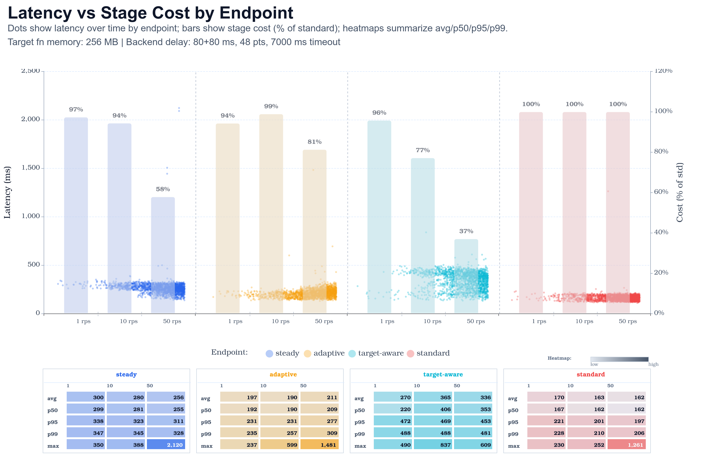
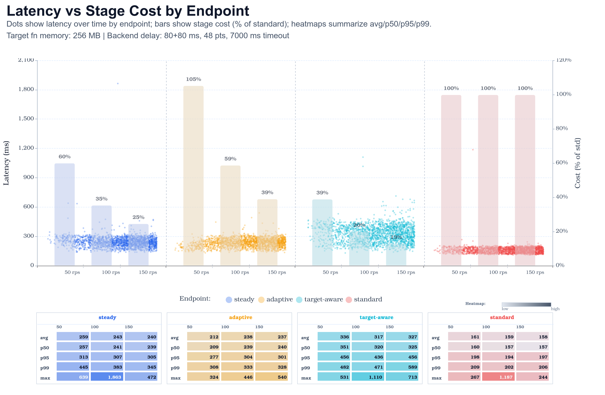

# Benchmark results

Khone trades a small amount of gateway latency for fewer target Lambda invocations. Read the public
snapshot in that frame: steady, adaptive, and target-aware batching are useful when batching reduces
enough downstream work to justify the extra hop.

The public runs used 256 MB target Lambdas, an LMI capacity provider configured with m8g instances,
and four warm gateway execution environments during the final pass. Round 2 is shown because it
reduces first-round scale and empty-state effects.

This is an I/O-bound scenario. Each target Lambda calls the same benchmark backend Lambda URL, and
that backend sleeps before returning JSON. The backend delay is part of the scenario, not the k6
`max-delay` query value.

## Scenario metadata

| Setting | Value |
| :-- | :-- |
| Target function memory | `256 MB` |
| Target architecture | `arm64` |
| Gateway capacity provider | LMI provider configured with `m8g` instances |
| Gateway function memory | `2048 MB` |
| Gateway LMI capacity | `4/4` execution environments, `64` concurrent requests per environment, `2.0 GiB/vCPU` |
| Backend workload | Target Lambdas call a backend Lambda URL that simulates delayed downstream responses |
| Backend delay model | `80 ms` base delay plus up to `80 ms` item-key-seeded jitter (`80-160 ms`) |
| Backend work points | `48` |
| Backend timeout | `7000 ms` |
| Khone target concurrency | `16` |
| Gateway scaling for final pass | minimum `4` execution environments |
| Low traffic profile | 5m at 1 rps, then 5m ramping 1 to 10 rps, then 5m ramping 10 to 50 rps |
| High traffic profile | 3m ramping 0 to 50 rps, then 3m ramping 50 to 100 rps, then 3m ramping 100 to 150 rps |
| Error rate in round 2 summaries | Low traffic: `0.000%` for all endpoints. High traffic: steady and target-aware had `0.000%`; adaptive and standard each recorded 1 error out of 40,499 requests. |

## Cost summary

<picture>
  <source media="(prefers-color-scheme: dark)" srcset="../../assets/performance-cost/cost-estimate-summary-dark.svg">
  <source media="(prefers-color-scheme: light)" srcset="../../assets/performance-cost/cost-estimate-summary-light.svg">
  
</picture>

The cost bars are normalized to the standard endpoint at 100%. In this benchmark, target-aware
batching had the lowest estimated target invocation cost, especially at higher traffic.

| Traffic profile | Endpoint | P95 latency | Estimated target cost |
| --- | --- | ---: | ---: |
| Low, 1/10/50 rps | steady | 317 ms | 65.4% |
| Low, 1/10/50 rps | adaptive | 283 ms | 85.1% |
| Low, 1/10/50 rps | target-aware | 463 ms | 45.1% |
| Low, 1/10/50 rps | standard | 198 ms | 100.0% |
| High, 50/100/150 rps | steady | 308 ms | 32.4% |
| High, 50/100/150 rps | adaptive | 304 ms | 36.2% |
| High, 50/100/150 rps | target-aware | 464 ms | 17.7% |
| High, 50/100/150 rps | standard | 197 ms | 100.0% |

## Latency summary

<picture>
  <source media="(prefers-color-scheme: dark)" srcset="../../assets/performance-cost/p95-latency-summary-dark.svg">
  <source media="(prefers-color-scheme: light)" srcset="../../assets/performance-cost/p95-latency-summary-light.svg">
  
</picture>

The standard endpoint was fastest in these runs because it avoids the Khone gateway hop and batching
wait. Target-aware batching intentionally waits longer when it expects batching to improve cost
efficiency, so it has the highest latency in exchange for the lowest estimated target invocation
cost.

| Traffic profile | steady P95 | adaptive P95 | target-aware P95 | standard P95 |
| --- | ---: | ---: | ---: | ---: |
| Low, 1/10/50 rps | 317 ms | 283 ms | 463 ms | 198 ms |
| High, 50/100/150 rps | 308 ms | 304 ms | 464 ms | 197 ms |

## Report charts

These generated charts show sampled latency over time, per-stage cost bars, and heatmap summaries
for each endpoint.

### Low traffic, round 2

<picture>
  <source media="(prefers-color-scheme: dark)" srcset="../../benchmark-results-public/low-256mb-min4-1-10-50-round2/charts/dark/latency-distribution.png">
  <source media="(prefers-color-scheme: light)" srcset="../../benchmark-results-public/low-256mb-min4-1-10-50-round2/charts/light/latency-distribution.png">
  
</picture>

### High traffic, round 2

<picture>
  <source media="(prefers-color-scheme: dark)" srcset="../../benchmark-results-public/high-256mb-min4-50-100-150-round2/charts/dark/latency-distribution.png">
  <source media="(prefers-color-scheme: light)" srcset="../../benchmark-results-public/high-256mb-min4-50-100-150-round2/charts/light/latency-distribution.png">
  
</picture>

## Concurrency and cold starts

A second-order effect of batching: fewer concurrent target invocations means fewer execution
environments, which means fewer cold starts. Spikes that would otherwise force Lambda to spin up new
sandboxes can often be absorbed by the warm ones already handling batches.

This effect is workload-dependent and is not directly measured by the public benchmark. It largely
disappears for routes that already run at steady high concurrency on a stable footprint. It also
depends on the handler being able to make progress while items are waiting on I/O; pure CPU work
usually needs more compute, not a larger batch.

## What the estimate includes

The benchmark cost estimate focuses on target Lambda invocation work. It uses gateway-observed batch
sizes and target response wait time instead of raw client HTTP duration, because client duration
includes batching delay before the target function starts.

The estimate is still not a substitute for an AWS bill:

- It does not include gateway LMI capacity cost.
- It does not include Function URL, API Gateway, CloudWatch, data transfer, or VPC endpoint charges.
- It does not use Lambda `REPORT` billed duration for every target invocation.
- It is best used for relative scenario comparison, not absolute pricing.

## Public report links

- [High traffic, round 1](../../benchmark-results-public/high-256mb-min4-50-100-150-round1/report.md)
- [High traffic, round 2](../../benchmark-results-public/high-256mb-min4-50-100-150-round2/report.md)
- [Low traffic, round 1](../../benchmark-results-public/low-256mb-min4-1-10-50-round1/report.md)
- [Low traffic, round 2](../../benchmark-results-public/low-256mb-min4-1-10-50-round2/report.md)

Read [Benchmark methodology](methodology.md) before comparing these numbers to another workload.
