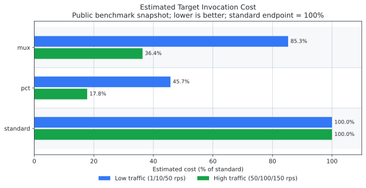
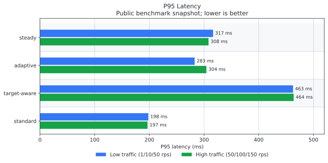

# Performance and Cost

The benchmark results are important because Khone exists to trade a small amount of gateway latency
for fewer target Lambda invocations. The public benchmark snapshot should be read in that frame:
mux and pct are useful when batching reduces enough downstream work to justify the extra hop.

The charts below summarize the curated public runs at 256 MB target-function memory, with the
gateway running on LMI and using a minimum of four execution environments during the final benchmark
pass. Round 2 is shown because it reduces first-round scale and empty-state effects.

## Scenario Metadata

| Setting | Value |
| :-- | :-- |
| Target function memory | `256 MB` |
| Backend delay model | `80 ms` base delay plus `80 ms` jitter |
| Backend work points | `48` |
| Backend timeout | `7000 ms` |
| Khone target concurrency | `16` |
| Gateway scaling for final pass | minimum `4` execution environments |
| Low traffic profile | 5m at 1 rps, then 5m ramping 1 to 10 rps, then 5m ramping 10 to 50 rps |
| High traffic profile | 3m ramping 0 to 50 rps, then 3m ramping 50 to 100 rps, then 3m ramping 100 to 150 rps |
| Error rate in round 2 summaries | `0.000%` for mux, pct, and standard |

## Cost Summary

<picture>
  <source media="(prefers-color-scheme: dark)" srcset="../assets/performance-cost/cost-estimate-summary-dark.svg">
  <source media="(prefers-color-scheme: light)" srcset="../assets/performance-cost/cost-estimate-summary-light.svg">
  
</picture>

The cost bars are normalized to the standard endpoint at 100%. In this benchmark, pct had the
lowest estimated target invocation cost, especially at higher traffic. Mux also reduced estimated
cost at high traffic, but was less effective in the low-traffic profile.

| Traffic profile | Endpoint | P95 latency | Estimated target cost |
| --- | --- | ---: | ---: |
| Low, 1/10/50 rps | mux | 275 ms | 85.3% |
| Low, 1/10/50 rps | pct | 460 ms | 45.7% |
| Low, 1/10/50 rps | standard | 198 ms | 100.0% |
| High, 50/100/150 rps | mux | 302 ms | 36.4% |
| High, 50/100/150 rps | pct | 470 ms | 17.8% |
| High, 50/100/150 rps | standard | 202 ms | 100.0% |

## Latency Summary

<picture>
  <source media="(prefers-color-scheme: dark)" srcset="../assets/performance-cost/p95-latency-summary-dark.svg">
  <source media="(prefers-color-scheme: light)" srcset="../assets/performance-cost/p95-latency-summary-light.svg">
  
</picture>

The standard endpoint was fastest in these runs because it invokes the target function directly
through API Gateway. Mux and pct add a gateway hop plus batching wait time. Pct intentionally waits
longer when it expects batching to improve cost efficiency, so it has the highest latency in
exchange for the lowest estimated target invocation cost.

| Traffic profile | mux P95 | pct P95 | standard P95 |
| --- | ---: | ---: | ---: |
| Low, 1/10/50 rps | 275 ms | 460 ms | 198 ms |
| High, 50/100/150 rps | 302 ms | 470 ms | 202 ms |

## Generated Benchmark Charts

These are the generated PNG charts from the curated public reports. They show sampled latency over
time, per-stage cost bars, and heatmap summaries for each endpoint.

### Low Traffic, Round 2

<picture>
  <source media="(prefers-color-scheme: dark)" srcset="../../benchmark-results-public/low-256mb-min4-1-10-50-round2/charts/dark/latency-distribution.png">
  <source media="(prefers-color-scheme: light)" srcset="../../benchmark-results-public/low-256mb-min4-1-10-50-round2/charts/light/latency-distribution.png">
  
</picture>

### High Traffic, Round 2

<picture>
  <source media="(prefers-color-scheme: dark)" srcset="../../benchmark-results-public/high-256mb-min4-50-100-150-round2/charts/dark/latency-distribution.png">
  <source media="(prefers-color-scheme: light)" srcset="../../benchmark-results-public/high-256mb-min4-50-100-150-round2/charts/light/latency-distribution.png">
  
</picture>

## What the Estimate Includes

The benchmark cost estimate focuses on target Lambda invocation work. It uses gateway-observed
batch sizes and target response wait time instead of raw client HTTP duration, because client
duration includes batching delay before the target function starts.

The estimate is still not a substitute for an AWS bill:

- It does not include gateway LMI capacity cost.
- It does not include Function URL, API Gateway, CloudWatch, data transfer, or VPC endpoint charges.
- It does not use Lambda `REPORT` billed duration for every target invocation.
- It is best used for relative scenario comparison, not absolute pricing.

## Public Report Links

- [High traffic, round 1](../../benchmark-results-public/high-256mb-min4-50-100-150-round1/report.md)
- [High traffic, round 2](../../benchmark-results-public/high-256mb-min4-50-100-150-round2/report.md)
- [Low traffic, round 1](../../benchmark-results-public/low-256mb-min4-1-10-50-round1/report.md)
- [Low traffic, round 2](../../benchmark-results-public/low-256mb-min4-1-10-50-round2/report.md)

Each public report contains sanitized scenario metadata, summary CSV output, and themed latency distribution charts. Raw URLs, account IDs, ARNs, sampled time series, and full metric logs are intentionally excluded from public bundles.
